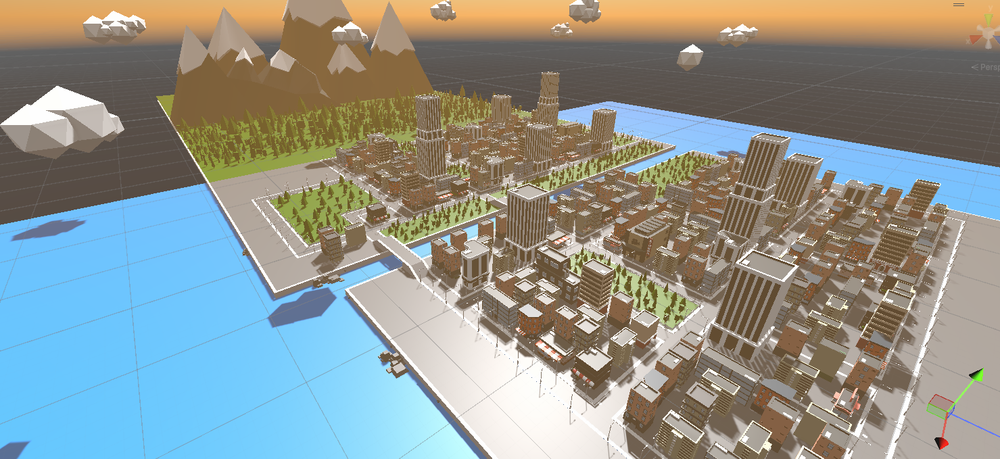
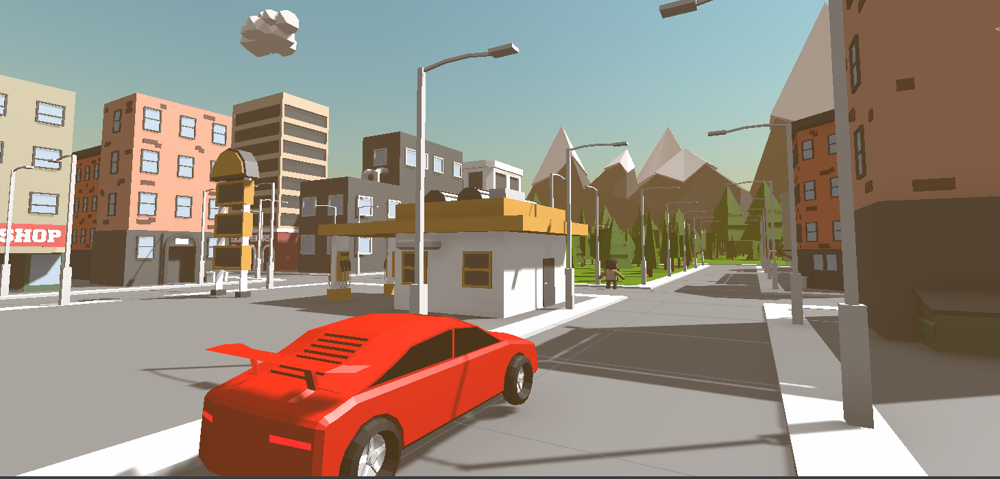
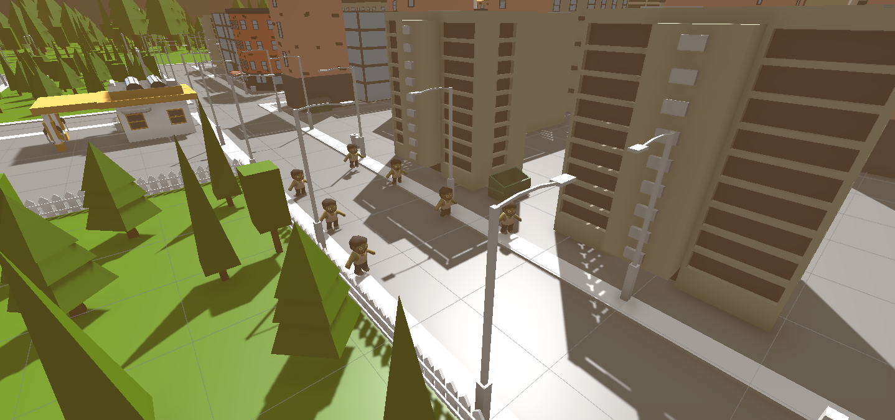

# 🚗 Road of the Dead  

## 🎮 Descrição do Jogo e Controles  

Este é um jogo desenvolvido na Unity que possui um **mapa aberto**, onde o jogador controla um carro e deve **eliminar os zumbis antes que eles destruam o veículo**.  

**Controles:**  

- **W / S / A / D**: Movimentação do carro  
- **Mouse**: Controle da câmera  
- **Esc**: Abrir menu principal  
- **Q**: Alternar entre **dia e noite**  
- **E**: Ligar/desligar o **farol do carro**  
- **1**: Câmera em **3ª pessoa**  
- **2**: Câmera **interna (cockpit)**  
- **3**: Câmera **na roda**  

---

## 📖 História do Jogo  

Em uma cidade devastada por zumbis, seu único meio de sobrevivência é um carro.  
Você deve dirigir pelas ruas e **eliminar os zumbis** que tentam destruir o veículo.  
Gerencie sua estratégia e sobreviva o máximo possível enquanto enfrenta hordas implacáveis.  

---

## 🕹️ Gameplay  

Veja abaixo um vídeo demonstrativo do jogo em execução:  

 

---

## 📸 Prints do Jogo  

### Cidade  
  

### Carro  
  

### Zumbis  
  

---

## 📬 Contato  

👤 **Caio Taveira**  
